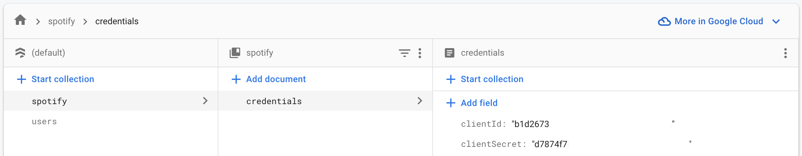

# Mixboard

* Clone the code
* Open the project in xcode
* Change the bundle identifier to your company's bundle id
* Create a new firebase project, follow the official documentation to add to ios project. 
    - Enable both email/password and AppleID authentication
    - Enable Firestore Database
    - Copy the GoogleService-Info.plist into the mixboard source folder
* Create a new spotify app from the spotify developer dashboard.
    - Replace the redirect URL in Config.swift line 12 with the one from your spotify app settings
    - Make sure the bundle ID matches with your target's bundle ID
* Copy the ClientID and Secret from settings and paste it on to firestore database following the below shown structure

* Change the server IP in Config.swift line 11 with your mixboard server's IP

* Build and run! Minimum iOS version is 16.0
